# GovGlide / GlideGov Assistant

Monorepo for the GovGlide government scheme assistant.

## Architecture

```mermaid
flowchart TB
  subgraph UserLayer [User]
    User[User / Browser]
  end

  subgraph FrontendLayer [Frontend - Vite + React + TypeScript]
    WebApp[Web App]
    WebApp --> Index[Index / Landing]
    WebApp --> Chat[Chat - Live voice]
    WebApp --> Dashboard[Dashboard]
    WebApp --> AutoFiller[AutoFiller]
    WebApp --> DataVault[DataVault]
  end

  subgraph BackendLayer [Backend - Rails 7 API]
    Rails[Rails API]
    Rails --> SessionsAPI[Sessions API]
    Rails --> SchemesAPI[Schemes / Discover]
    Rails --> EligibilityAPI[Eligibility Check]
    Rails --> FormNavAPI[Form Navigation]
    Rails --> TurnsAPI[Conversation Turns]
    Rails --> GeminiClient[GeminiClient]
    GeminiClient --> GeminiREST[generateContent / Vision]
    Rails --> LiveBridge[GeminiLiveBridgeService]
    LiveBridge --> GeminiLive[Gemini Live API WebSocket]
    Rails --> DiscoverySvc[SchemeDiscoveryService]
    Rails --> EligibilitySvc[EligibilityService]
    Rails --> FormNavSvc[FormNavigationService]
    Rails --> LiveContextSvc[LiveContextService]
  DiscoverySvc --> GoogleSearch[Google Custom Search]
  end

  subgraph CableLayer [ActionCable]
    Cable[Rails ActionCable Server]
    Cable --> SessionChannel[SessionChannel]
    Cable --> LiveAgentChannel[LiveAgentChannel]
    SessionChannel --> RedisCable[(Redis pub/sub)]
    LiveAgentChannel --> RedisCable
  end

  subgraph WorkerLayer [Sidekiq]
    Sidekiq[Sidekiq Workers]
    Sidekiq --> DiscoveryJob[SchemeDiscoveryJob]
    Sidekiq --> EligibilityJob[EligibilityCheckJob]
    Sidekiq --> FormNavJob[FormNavigationJob]
    DiscoveryJob --> DiscoverySvc
    EligibilityJob --> EligibilitySvc
    FormNavJob --> FormNavSvc
  end

  subgraph DataLayer [Data]
    MySQL[(MySQL)]
    Redis[(Redis)]
  end

  User <--> WebApp
  WebApp -->|REST HTTP| Rails
  WebApp -->|WebSocket /cable| Cable
  Rails --> MySQL
  Rails --> Redis
  Rails -->|enqueue| Sidekiq
  Sidekiq --> Redis
  Sidekiq --> MySQL
  EligibilitySvc --> GeminiClient
  FormNavSvc --> GeminiClient
  FormNavSvc --> Playwright[Playwright]
  LiveBridge --> GeminiLive
  LiveAgentChannel --> LiveBridge
```




**Layers summary**


| Layer           | Components                                                 | Role                                                                                                                                                                                                             |
| --------------- | ---------------------------------------------------------- | ---------------------------------------------------------------------------------------------------------------------------------------------------------------------------------------------------------------- |
| **Frontend**    | Vite, React, TypeScript                                    | Index, Chat (Live voice), Dashboard, AutoFiller, DataVault. REST calls to backend; WebSocket to ActionCable for live updates and Live agent.                                                                     |
| **Backend**     | Rails 7 API                                                | REST APIs (sessions, schemes, eligibility, form navigation, turns). GeminiClient (REST) and GeminiLiveBridgeService (WebSocket) for Gemini. Services: SchemeDiscovery, Eligibility, FormNavigation, LiveContext. |
| **ActionCable** | SessionChannel, LiveAgentChannel                           | SessionChannel: form progress, screenshots, handoff, eligibility_done. LiveAgentChannel: voice bridge to Gemini Live (audio + tools). Redis for pub/sub.                                                         |
| **Sidekiq**     | SchemeDiscoveryJob, EligibilityCheckJob, FormNavigationJob | Async discovery, eligibility checks, Playwright form filling. Uses same services and DB.                                                                                                                         |
| **Data**        | MySQL, Redis                                               | MySQL: sessions, schemes, eligibility_results, session_discoveries, form_progresses, conversation_turns. Redis: Sidekiq queues + ActionCable adapter.                                                            |
| **Gemini**      | GeminiClient, Live API                                     | REST: generateContent (eligibility), generate_content_with_image (form screenshots). Live: real-time voice, tools (discover_schemes, check_eligibility).                                                         |


## Structure

- **frontend/** – GovGlide web app (Vite + React + TypeScript). Run from this directory: `npm install`, `npm run dev`, `npm run build`.
- **backend/** – Rails 7 API, Sidekiq, ActionCable; see `backend/backend_architecture.md`.

## How to run (Docker)

**Yes — you only need `docker compose up`.** The backend entrypoint runs DB creation and migrations before starting the Rails server.

### One-time setup

1. **Create `backend/.env`** for the backend container (API keys, etc.). For full functionality, include:
  - `GEMINI_API_KEY` – required for eligibility, form navigation (vision), and Live voice agent.
  - `GOOGLE_SEARCH_API_KEY` and `GOOGLE_SEARCH_CX` – required for scheme discovery (Google Custom Search).
2. From the **glidegov-assistant** directory:
  ```bash
   docker compose up
  ```
   First run will build images and pull MySQL/Redis. The backend waits for MySQL to be healthy, then runs `rails db:create` and `rails db:migrate` and starts the server. No manual DB or table creation is needed.

### After it’s running

- **Frontend:** [http://localhost:8082](http://localhost:8082)  
- **Backend API:** [http://localhost:3001](http://localhost:3001)  
- **Sidekiq:** no UI by default; jobs run in the `sidekiq` container.

### Optional: run only some services

```bash
docker compose up mysql redis backend frontend   # no Sidekiq – async jobs won’t run
docker compose up mysql redis backend sidekiq    # no frontend – use API only
```

---

## Quick start (local dev without Docker)

```bash
# Frontend only
cd frontend
npm install
npm run dev
```

For full stack you need MySQL, Redis, and the backend (and optionally Sidekiq) running locally; see `backend/backend_architecture.md`.